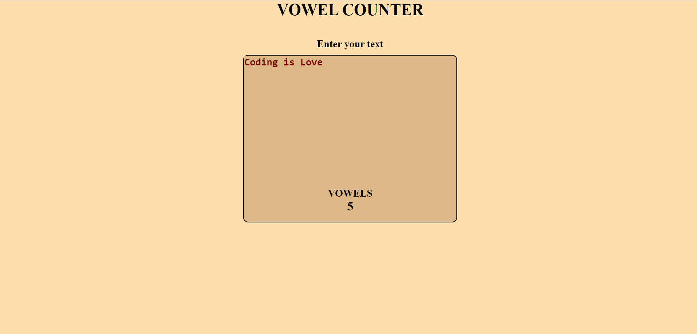

# Vowel Counter

## Introduction
Vowel Counter counts the no. of vowels in the string entered by the user at real time.

## Implementation

## Tech Stack
* HTML
* CSS
* JAVASCRIPT

## Website
Click [here](https://vowelcounter-28fcc.web.app/) to view.
